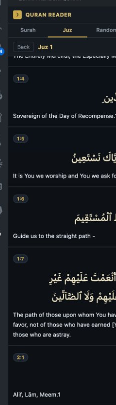
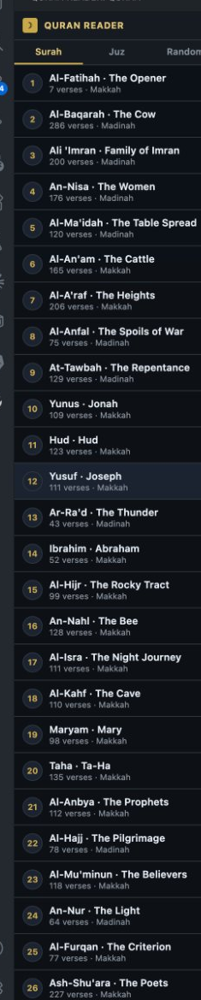

# Quran Reader for VS Code

Read the Holy Quran without leaving your editor. A beautiful, distraction-free Quran reader right inside VS Code — with Arabic text, English translation, transliteration, and audio recitation.

  

## Features

- **📖 Browse by Surah** — All 114 chapters with Arabic names, English names, verse count, and revelation place
- **📚 Browse by Juz** — All 30 Juz with verse-by-verse navigation
- **🎲 Random Verse** — Get inspired with a random ayah
- **🔍 Search** — Search the Quran by keyword in English or Arabic
- **🎵 Audio Recitation** — Listen to every verse by Sheikh Abdul Samad
- **✨ Two Reading Modes:**
  - **Verse by Verse** — Each verse as a card with Arabic, transliteration, and translation
  - **Reading Mode** — Flowing continuous Arabic text like a Mushaf, with translation below
- **🔤 UthmanicHafs Font** — The same beautiful font used on Quran.com

  

## No Setup Required

Just install and start reading. No API keys, no accounts, no configuration needed.

## Usage

1. Click the **Quran Reader icon** (☽) in the Activity Bar on the left
2. Choose **Surah**, **Juz**, **Random**, or **Search**
3. Click any Surah or Juz to open it
4. Toggle between **Verse by Verse** (☷) and **Reading Mode** (☰) using the buttons in the header
5. Press ▶ on any verse to hear the audio recitation

## Settings

| Setting | Default | Description |
|---|---|---|
| `quranReader.translationId` | `20` | Translation ID (20 = Sahih International English) |
| `quranReader.showTransliteration` | `false` | Show romanized Arabic transliteration |

## Data Source

All Quran text, translations, and audio are served from the free public [Quran.com API](https://api.quran.com). No data is stored locally.

## Credits

- Quran text: [Tanzil Project](https://tanzil.net)
- Translations: [Quran.com](https://quran.com)
- Audio: Sheikh Abdul Samad via [EveryAyah.com](https://everyayah.com)
- Font: KFGQPC Hafs Uthmanic Script

---

*May this tool make it easier to connect with the Quran in your daily workflow.*
